# IBM-Cloud-Setup
Instuctions on how to setup an IBM cloud account with Node Red enabled.

Here is the URL for registration https://console.bluemix.net/registration/

After following the registration process you will be asked to confirm your email befor your account is activated. Once your account has been activated please use this link to jump to your dashboard. You may need to login first.

IBM cloud dashboard here! https://console.bluemix.net/dashboard/

# Node Red install as an IBM Cloud Service

1. Click on create resource this will take you to a screen where you can choose the node red application.

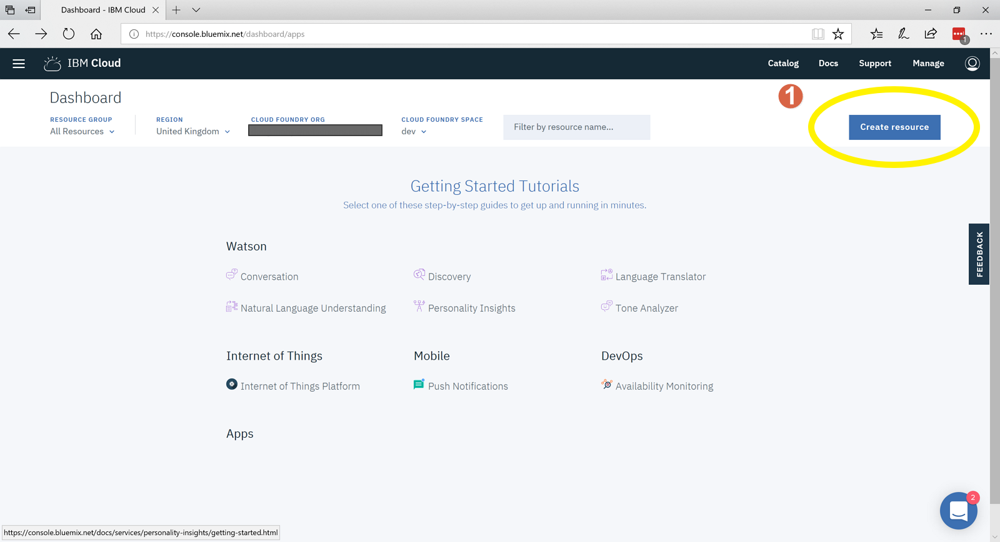

1. Click on Node-RED Starter this will take you too the Clound Foundry Application Configuration screen.

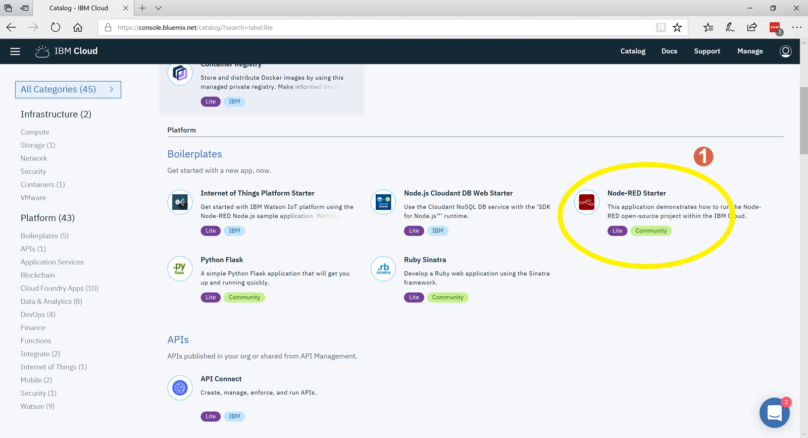

1. Enter the app name you would like to call your Node-RED application instance. This name will show up as part of your URL.
2. Click create this will now create the application.

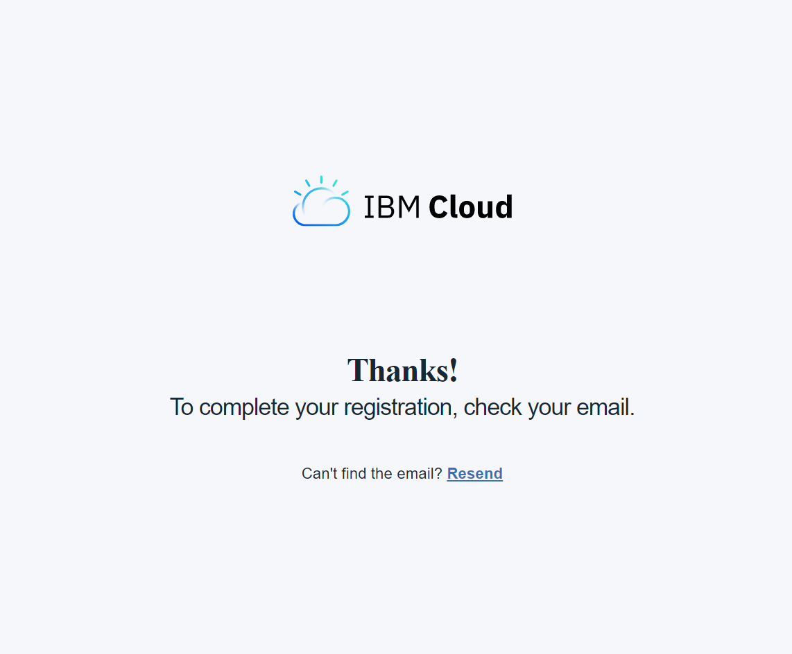

1. You may find yourself at this helpful blank screen. Click on the IBM cloud.

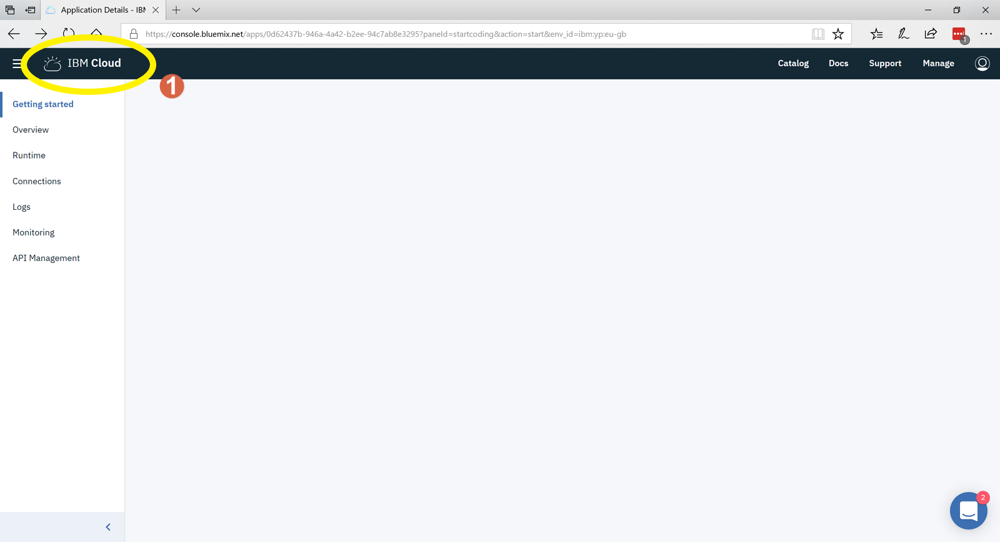

1. Check to see if the application is running if not then you need to start it.
2. Click on the three vertical dots to bring up the menu.
3. Click on the Start App option to start the application. It may take sometime to start or timeout completley. If it does just click on the cloud in the top left corner again. 

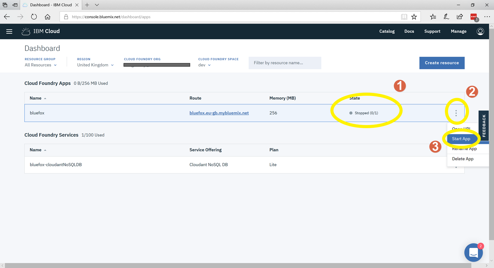

1. If the Appliation is showing as Awake.
2. Click on the URL under route to take you to the Node-RED setup screens.

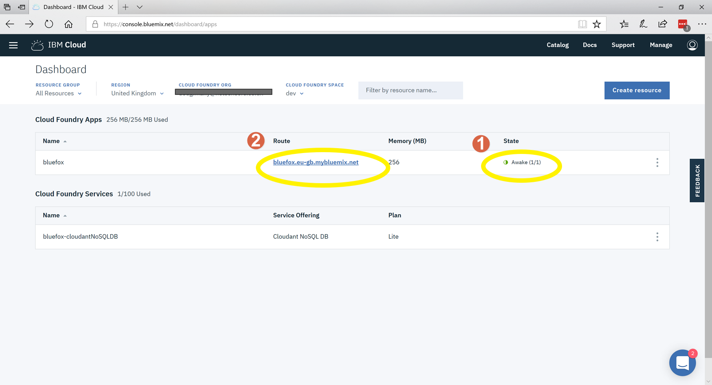

1. Click on Next

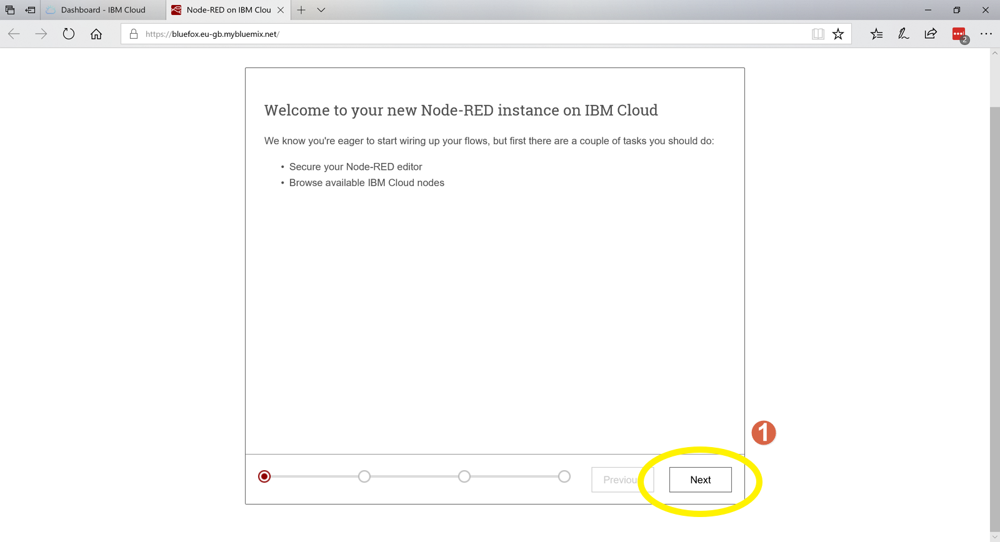

1. Enter your username, your email is usually a good idea.
2. Enter your password.
3. Click, Next and you will be shown some information that is not relevant at the moment.

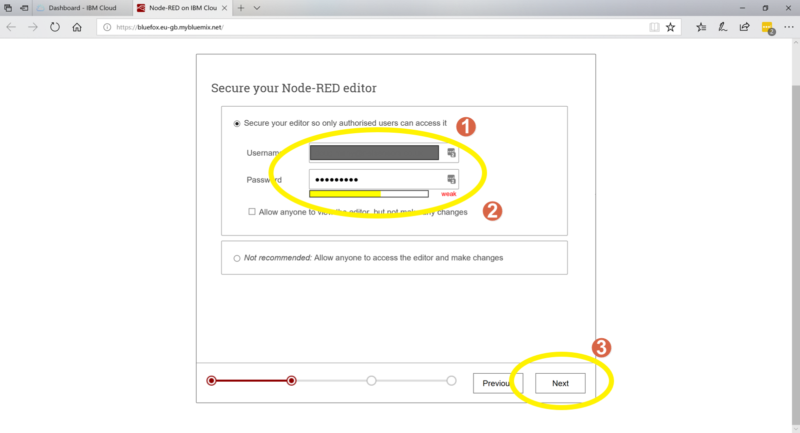

1. Click Next, you will be shown some more information that is not relevant at the moment.

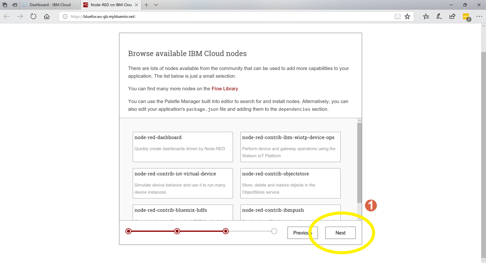

1. Click Finish, You will be shown more information that may be a little interesting 

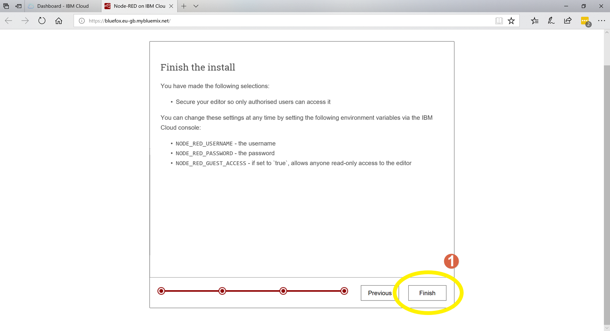

1. Click on 'Go to your Node-RED flow editor'

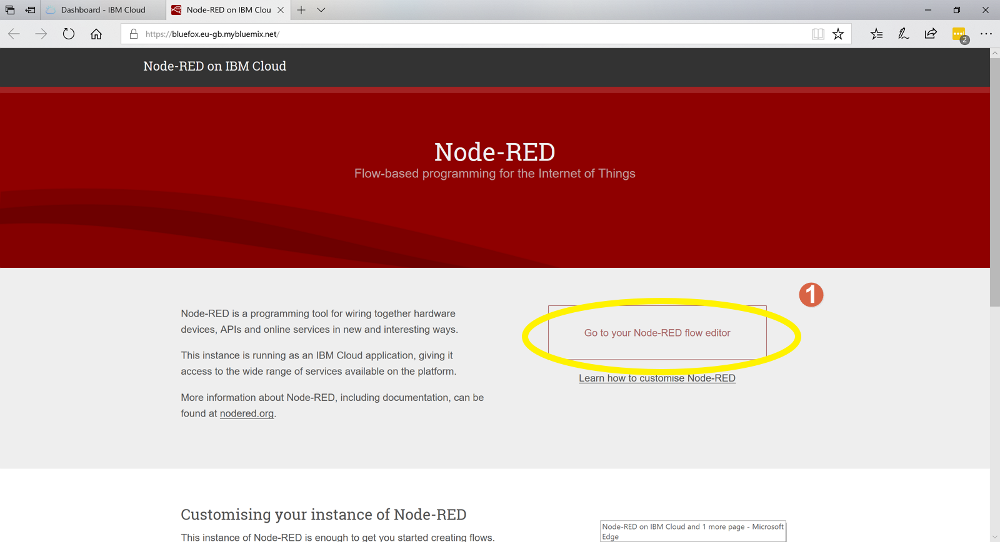
\
\
\
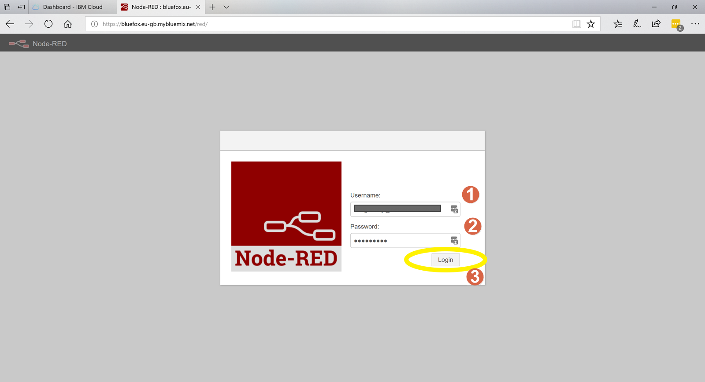
\
\
\
