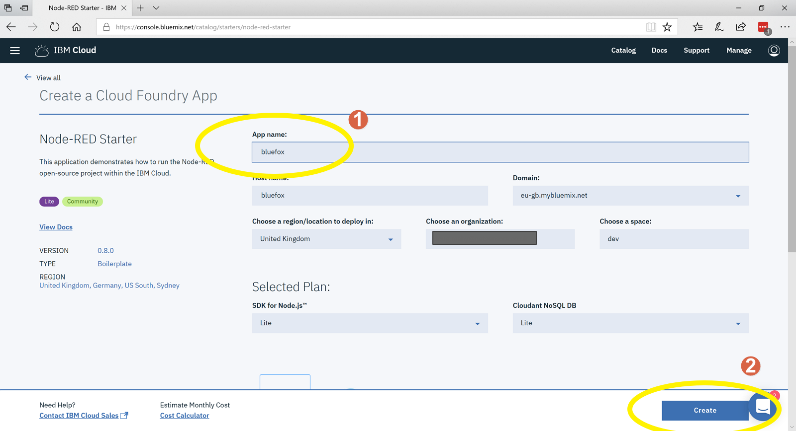

# IBM-Cloud-Setup
Instuctions on how to setup an IBM cloud account with Node Red enabled

Here is the URL for registration https://console.bluemix.net/registration/

After following the registration process you will be asked to confirm your email befor your account is activated. Once your account has been activated please use this link to jum to your dashboard. You may need to login first.

IBM cloud dashboard here! https://console.bluemix.net/dashboard/

\
\

\
\
\

\
\
\

\
\
\

\
\
\

\
\
\

\
\
\

\
\
\

\
\
\

\
\
\

\
\
\

\
\
\

\
\
\
